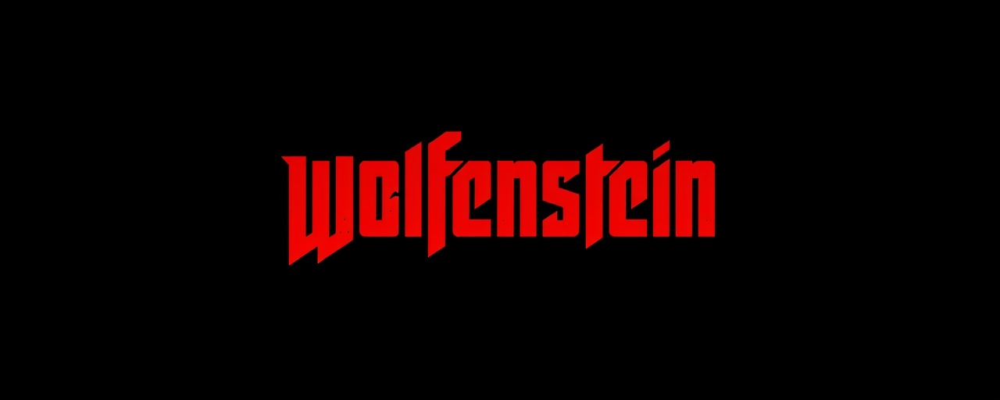
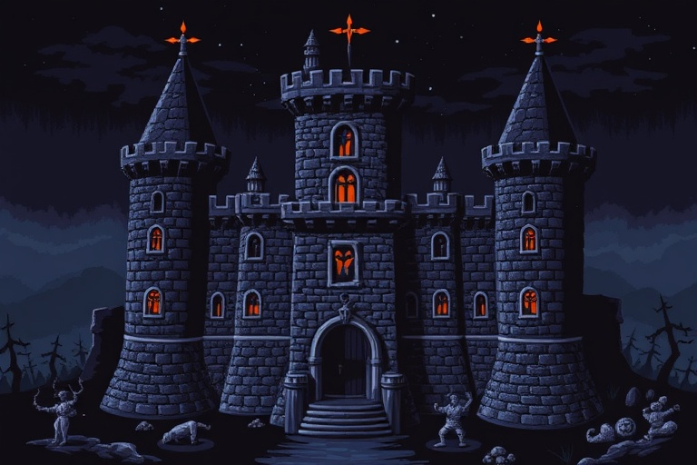

<h1 align="center">🕹️ Wolfenstein Serisi Tarihi Web Sitesi</h1>

  

---

<h2>📖 Proje Hakkında</h2>

Bu proje, <b>Wolfenstein</b> serisinin geçmişten günümüze tüm oyunlarını, hikayelerini ve gelişimini modern ve şık bir web arayüzüyle sunar.  
HTML, CSS  ve JavaScript ile hazırlanmıştır.  
Kullanıcılar, oyun kartlarına tıklayarak detaylı bilgi modalı görebilir ve zaman çizelgesinde serinin evrimini inceleyebilir.

---

<h2>🚀 Özellikler</h2>
<ul>
  <li> Modern tasarım</li>
  <li>Zaman çizelgesi ile serinin evrimi</li>
  <li>Yumuşak kaydırma ve animasyonlar</li>
  <li>Görsellerle zenginleştirilmiş içerik</li>
</ul>

---

<h2>🖼️ Önizleme</h2>

  
  

---

<h2>🛠️ Kurulum ve Kullanım</h2>
<ol>
  <li>Projeyi indirin veya klonlayın:
    <pre><code>git clone https://github.com/Darkingfate/Wolfenstein.git</code></pre>
  </li>
  <li>Proje klasörüne girin:
    <pre><code>cd Wolfenstein</code></pre>
  </li>
  <li>Herhangi bir sunucuya gerek yoktur, <b>wolfenstein.html</b> dosyasını tarayıcınızda açmanız yeterlidir.</li>
</ol>

---

<h2>📄 Lisans</h2>

  <b>MIT Lisansı</b> ile lisanslanmıştır. 
  <i>Bu projeyi özgürce kullanabilir, değiştirebilir ve dağıtabilirsiniz. Tek şart, orijinal lisans ve telif hakkı bilgisini korumanızdır.</i>

MIT Lisansı Detayları

<pre>
MIT License

Copyright (c) 2024 Yiğit Şahin

Permission is hereby granted, free of charge, to any person obtaining a copy
of this software and associated documentation files (the "Software"), to deal
in the Software without restriction, including without limitation the rights
to use, copy, modify, merge, publish, distribute, sublicense, and/or sell
copies of the Software, and to permit persons to whom the Software is
furnished to do so, subject to the following conditions:

The above copyright notice and this permission notice shall be included in all
copies or substantial portions of the Software.

THE SOFTWARE IS PROVIDED "AS IS", WITHOUT WARRANTY OF ANY KIND, EXPRESS OR
IMPLIED, INCLUDING BUT NOT LIMITED TO THE WARRANTIES OF MERCHANTABILITY,
FITNESS FOR A PARTICULAR PURPOSE AND NONINFRINGEMENT. IN NO EVENT SHALL THE
AUTHORS OR COPYRIGHT HOLDERS BE LIABLE FOR ANY CLAIM, DAMAGES OR OTHER
LIABILITY, WHETHER IN AN ACTION OF CONTRACT, TORT OR OTHERWISE, ARISING FROM,
OUT OF OR IN CONNECTION WITH THE SOFTWARE OR THE USE OR OTHER DEALINGS IN THE
SOFTWARE.
</pre>

---

<h2>👨‍💻 Katkıda Bulunanlar</h2>
<ul>
  <li>
    <b>Yiğit Şahin</b>  
    <a href="https://www.linkedin.com/in/yigit-sahin-570556285/" target="_blank">
      
      
    
  </li>
</ul>

---

<h2>💡 Notlar</h2>
<ul>
  <li>Proje tamamen eğitim ve portföy amaçlıdır.</li>
  <li>Wolfenstein markası ve görselleri ilgili hak sahiplerine aittir.</li>
  <li>Görsel önizlemeler için <code>images</code> klasöründeki resimleri kullanabilirsiniz.</li>
</ul> 
